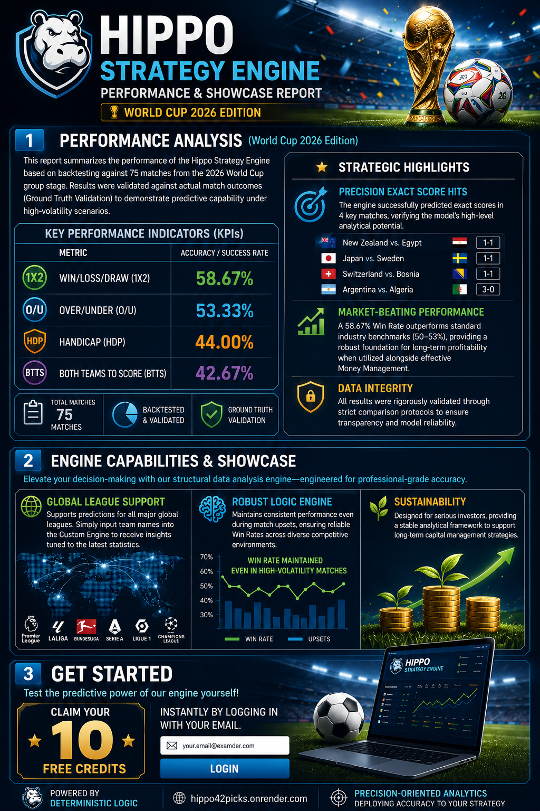
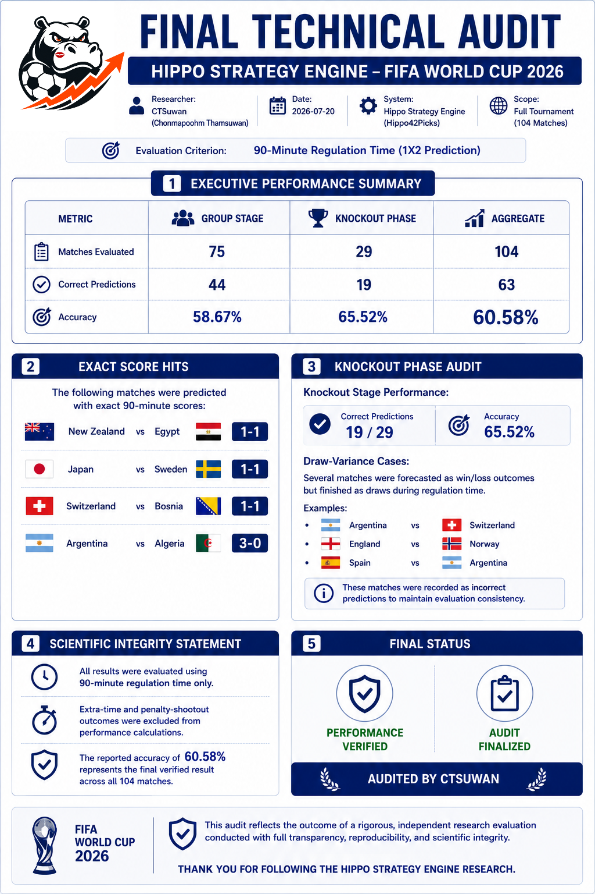

# Hippo Strategy Engine

Prediction Analytics & Decision Support Research

Hippo Strategy Engine is an independent prediction analytics project developed to evaluate decision-support methodologies using real-world competitive data.

This portfolio section documents the public evaluation of the system during the FIFA World Cup 2026 tournament.

---

## Project Overview

Competition

- FIFA World Cup 2026

Evaluation Scope

- Full Tournament

Matches Evaluated

- 104 Matches

Evaluation Criterion

- 90-Minute Regulation Time (1X2)

---

## Public Demonstration

Website

- https://www.hippo42picks.onrender.com

---

## System Preview

### Hippo Strategy Engine

---

## Group Stage Results

Group Stage Performance

- Matches: 75
- Correct Predictions: 44
- Accuracy: 58.67%

---

## Final Tournament Results

Final Performance

- Matches: 104
- Correct Predictions: 63
- Accuracy: 60.58%

---

## Audit Reports

- world-cup-2026-audit-en.md
- world-cup-2026-audit-th.md

---

## Research Focus

- Predictive Analytics
- Decision Support Systems
- Performance Evaluation
- Forecasting Methodologies

---

## Researcher

CTSuwan
