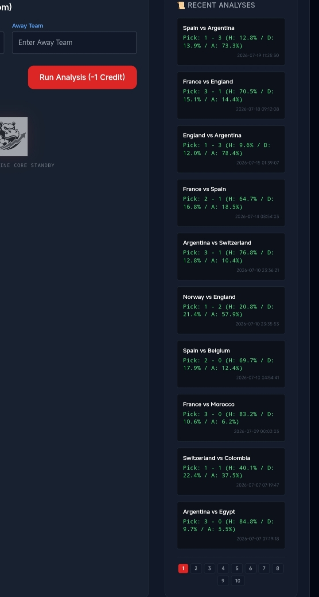
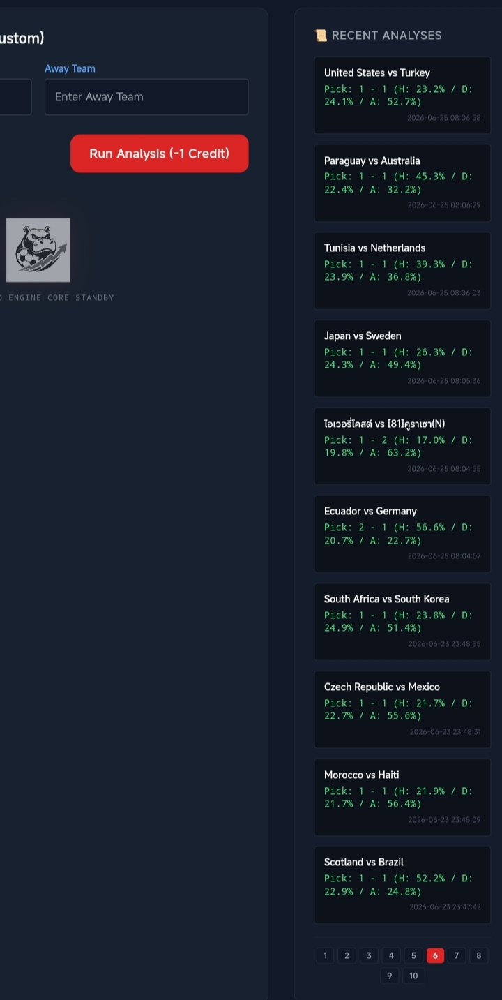
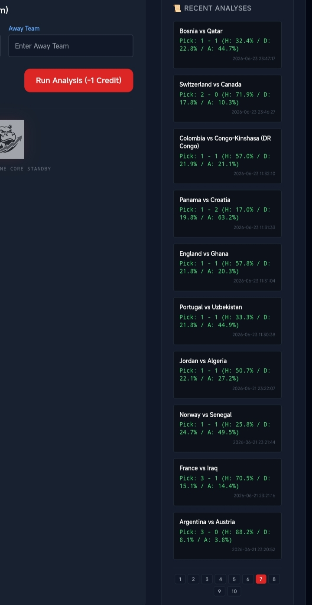
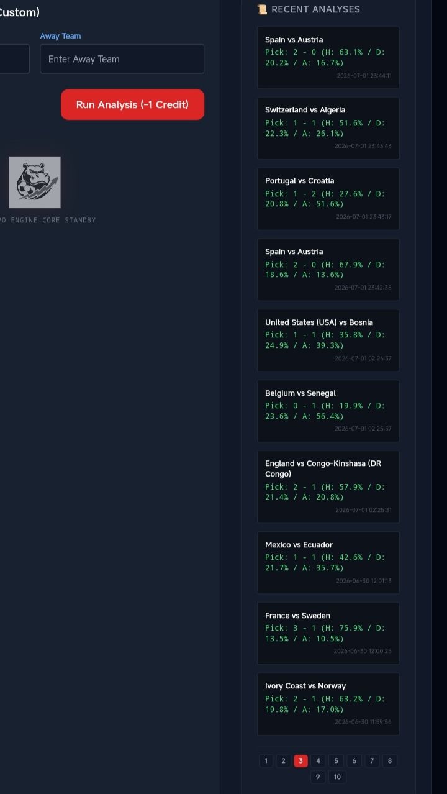
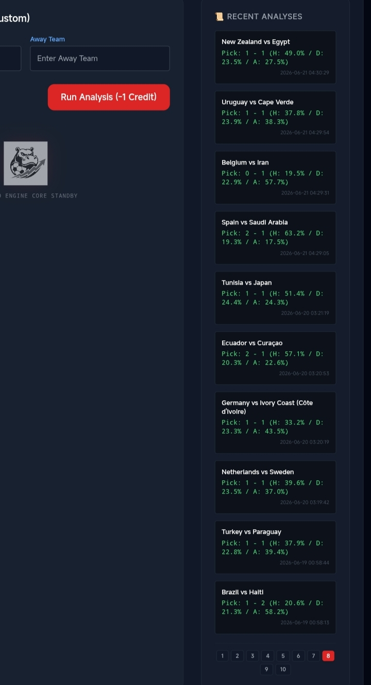
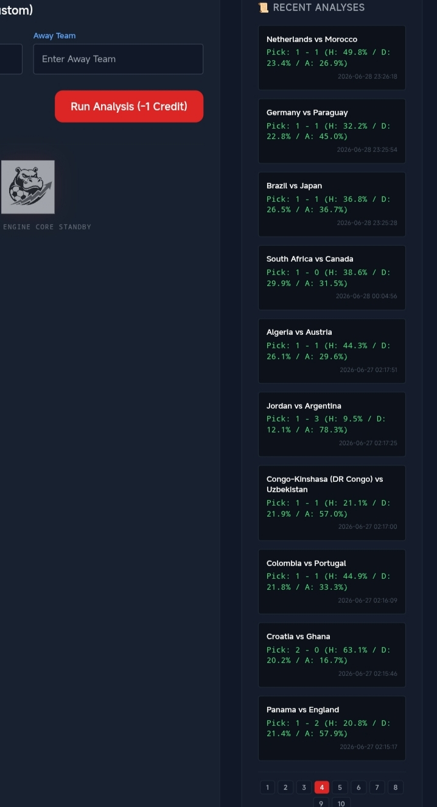
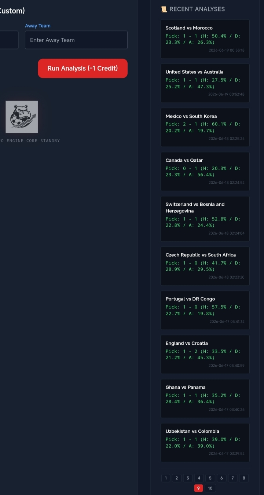
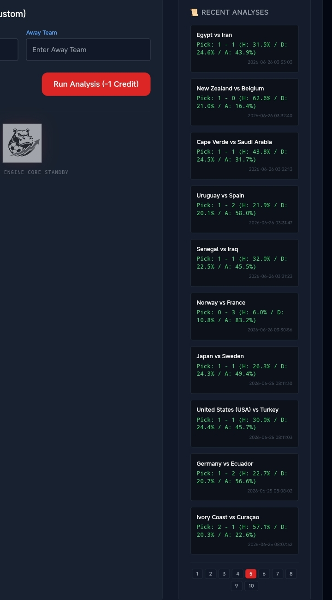
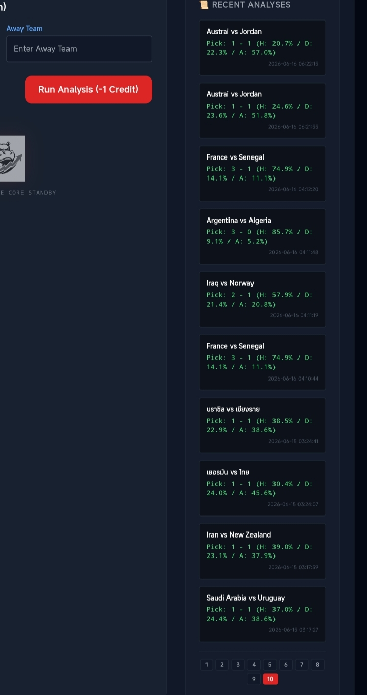

# Final Technical Audit

## Hippo Strategy Engine – FIFA World Cup 2026

Researcher: CTSuwan (Chonmapoohm Thamsuwan)

Date: 2026-07-20

System: Hippo Strategy Engine (Hippo42Picks)

Scope: Full Tournament (104 Matches)

Evaluation Criterion: 90-Minute Regulation Time (1X2 Prediction)

---

# Executive Performance Summary

| Metric | Group Stage | Knockout Phase | Aggregate |
|----------|----------:|----------:|----------:|
| Matches Evaluated | 75 | 29 | 104 |
| Correct Predictions | 44 | 19 | 63 |
| Accuracy | 58.67% | 65.52% | 60.58% |

---

# Exact Score Hits

The following matches were predicted with exact 90-minute scores:

- New Zealand vs Egypt — 1-1
- Japan vs Sweden — 1-1
- Switzerland vs Bosnia — 1-1
- Argentina vs Algeria — 3-0

---

# Knockout Phase Audit

Knockout Stage Performance:

- Correct Predictions: 19 / 29
- Accuracy: 65.52%

Draw-Variance Cases:

Several matches were forecasted as win/loss outcomes but finished as draws during regulation time.

Examples:

- Argentina vs Switzerland
- England vs Norway
- Spain vs Argentina

These matches were recorded as incorrect predictions to maintain evaluation consistency.

---

# Scientific Integrity Statement

All results were evaluated using 90-minute regulation time only.

Extra-time and penalty-shootout outcomes were excluded from performance calculations.

The reported accuracy of 60.58% represents the final verified result across all 104 matches.

---

## Real-Time Dashboard Audit Logs (100-Match Trace)

Below are the raw execution logs captured directly from the Hippo Picks live engine dashboard, recorded in UTC/GMT server time prior to each match kick-off.

### Snapshot Evidence Gallery (Pages 1–10)

| Pages 1 – 5 | Pages 6 – 10 |
| :---: | :---: |
|  |  |
|  |  |
|  |  |
|  |  |
|  |  |

> **Audit Note:** The logs display a continuous sequence of 100 predictive runs. Non-World Cup matches processed during the tournament cycle are preserved to maintain raw database logging integrity.
> 
# Final Status

Performance Verified

Audit Finalized

---

Audited by CTSuwan
