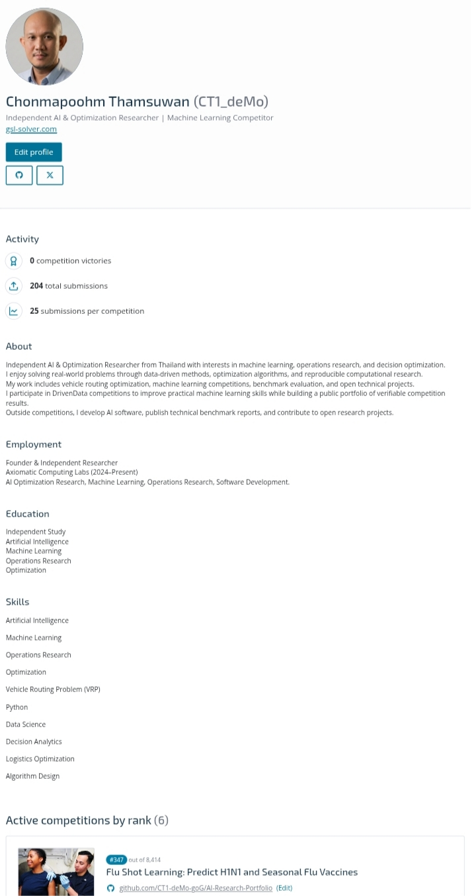

# AI, Optimization & Decision Support Research Portfolio
This repository serves as the central index of my public research portfolio, bringing together software projects, benchmark reports, machine learning competition results, and technical activities as an independent researcher.

The goal of this repository is to provide a transparent and verifiable record of my work across artificial intelligence, optimization, and applied machine learning.

---

# Research Areas

- Artificial Intelligence
- Machine Learning
- Predictive Analytics
- Decision Support Systems
- Operations Research
- Vehicle Routing Optimization
- Logistics Analytics
---

# Research Portfolio

# Portfolio Sections

## Machine Learning Competition Portfolio

Public competition participation and leaderboard records from DrivenData.

Location:

- .competitions/README.md

---

## Hippo Strategy Engine

Prediction analytics and decision support research using real-world competitive data.

Location:

- Hippo_Strategy_Engine/

---

## Geo Strategy Logistic (GSL) Solver

Deterministic vehicle routing optimization framework and public benchmark portfolio.

Location:

- gsl/

## Machine Learning Competition Portfolio

Platform:

- DrivenData

Current Statistics

- 204 Public Submissions
- 7 Competitions Participated

Selected Leaderboard Results

| Competition | Rank | Participants |
|-------------|-----:|------------:|
| Flu Shot Learning | **347** | 8,410 |
| Conser-vision Practice Area | **479** | 2,177 |
| Richter's Predictor | **544** | 8,319 |
| DengAI | **681** | 16,491 |
| Pump it Up | **1,174** | 18,861 |
| Children's Speech Recognition (Phonetic) | **90** | 394 |
| Children's Speech Recognition (Word) | **140** | 655 |

Detailed competition summaries are available in the **/competitions** directory.
<p align="center">
  
</p>
---

# Benchmark Portfolio

Vehicle Routing Problem (VRP)

- CVRP
- VRPTW
- MDVRP
- MDVRPTW

Public benchmark repositories are maintained separately.

---

# Professional Profiles

## Website

https://gsl-solver.com

## GitHub

https://github.com/CT1-deMo-goG

## LinkedIn

https://www.linkedin.com/in/ctsuwan

## ORCID

https://orcid.org/0009-0007-5444-2030

## DrivenData

https://www.drivendata.org/users/CT1_deMo/

---

# Repository Structure

```text
AI-Research-Portfolio

├── competitions/
│
├── Hippo_Strategy_Engine/
│
├── gsl/
│
└── README.md
```


# Contact

Open to research collaboration, technical benchmarking, and applied AI & optimization projects.
