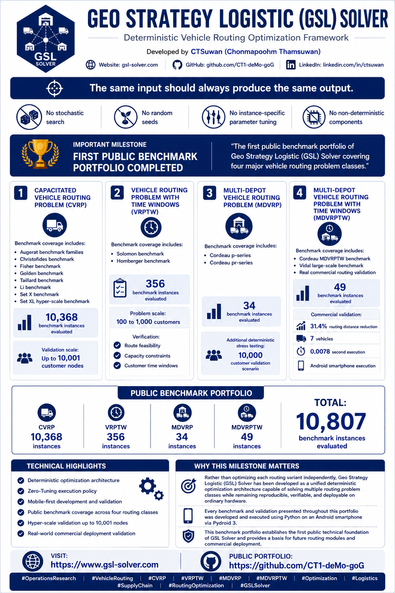

# Geo Strategy Logistic (GSL) Solver

Deterministic Vehicle Routing Optimization Framework

Geo Strategy Logistic (GSL) Solver is an independent deterministic vehicle routing optimization framework developed for logistics optimization, operations research, and decision support applications.

The framework focuses on reproducible optimization, benchmark-driven validation, and deterministic execution across multiple vehicle routing problem classes. Unlike stochastic approaches that rely on random seeds or instance-specific tuning, GSL Solver follows a deterministic execution policy where identical inputs produce identical outputs.

---

# Project Overview

Research Areas

- Operations Research
- Vehicle Routing Optimization
- Logistics Optimization
- Decision Support Systems
- Optimization Engineering

Supported Problem Classes

- Capacitated Vehicle Routing Problem (CVRP)
- Vehicle Routing Problem with Time Windows (VRPTW)
- Multi-Depot Vehicle Routing Problem (MDVRP)
- Multi-Depot Vehicle Routing Problem with Time Windows (MDVRPTW)

---

# Public Benchmark Milestone

The GSL benchmark portfolio covers four major vehicle routing problem classes and more than 10,000 public benchmark instances.

Key highlights include:

- Deterministic Optimization Architecture
- Zero-Tuning Execution Policy
- Mobile-First Development Workflow
- Public Benchmark Validation
- Hyper-Scale Testing (10,000+ Nodes)
- Commercial Routing Validation

---

# Official Website

GSL Solver Portal

https://gsl-solver.com

---

# Public Repositories

## Main Repository

https://github.com/CT1-deMo-goG/CT1-deMo-goG

## GSL Routing Engine

https://github.com/CT1-deMo-goG/gsl-routing-engine

## CVRP Benchmark Portfolio

https://github.com/CT1-deMo-goG/GSL-CVRP-SetX

https://github.com/CT1-deMo-goG/GSL-CVRP-SETXL

## VRPTW Benchmark Portfolio

https://github.com/CT1-deMo-goG/GSL-VRPTW-Portfolio

## MDVRP Benchmark Portfolio

https://github.com/CT1-deMo-goG/gsl-mdvrp-engine

## MDVRPTW Benchmark Portfolio

https://github.com/CT1-deMo-goG/gsl-mdvrptw-engine

---

# Technical Principles

GSL Solver is developed under the following principles:

- Deterministic Execution
- Reproducible Results
- Zero-Variance Outputs
- Benchmark-Based Validation
- Mobile-First Research Workflow
- Real-World Logistics Applicability

---

# Related Research Areas

- Artificial Intelligence
- Machine Learning
- Operations Research
- Logistics Analytics
- Vehicle Routing Optimization
- Decision Support Systems

---

# Researcher

CTSuwan

Chonmapoohm Thamsuwan

Independent Researcher

LinkedIn:
https://www.linkedin.com/in/ctsuwan

ORCID:
https://orcid.org/0009-0007-5444-2030
